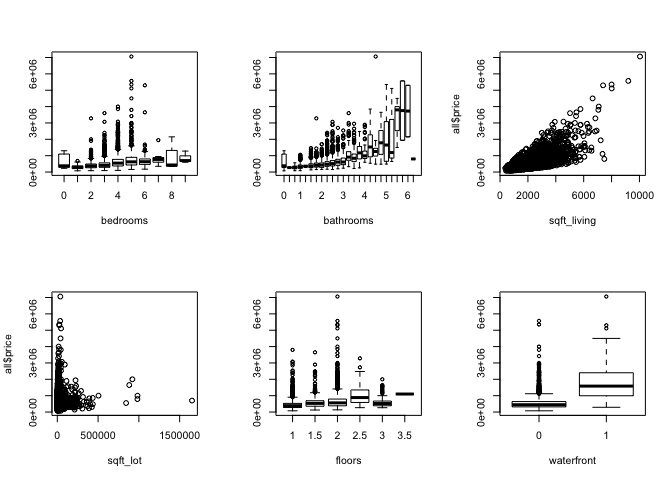
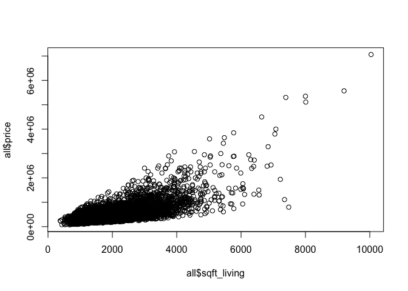
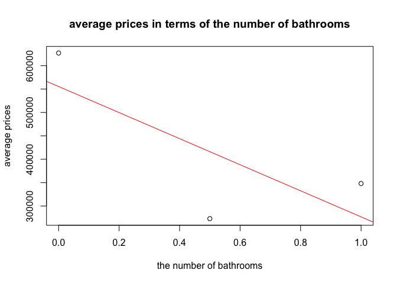
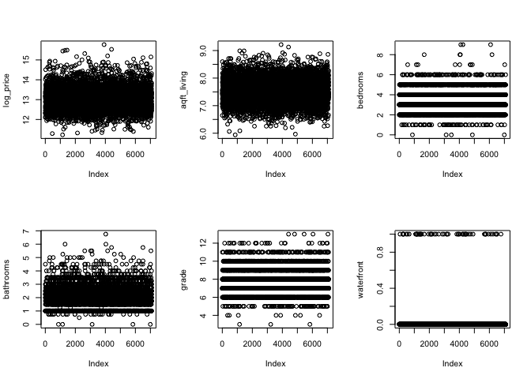
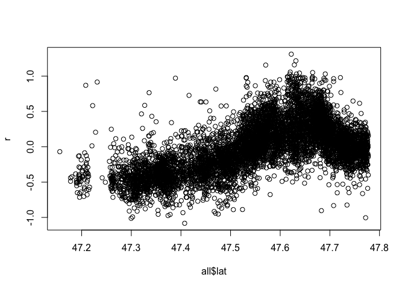
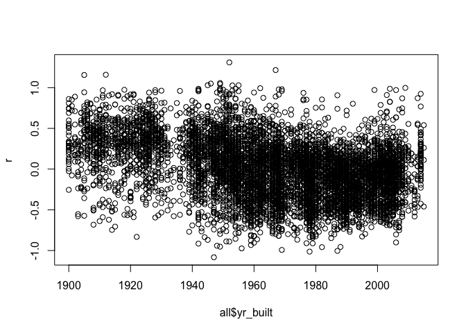

Housing Price Project
================
Fan Gong fg2399
2016/12/3

(a)
===

``` r
all <- read.csv("Training.csv", header = T)
par(mfrow=c(2,3))
boxplot(all$price~all$bedrooms, xlab="bedrooms")
boxplot(all$price~all$bathrooms, xlab="bathrooms")
plot(all$price~all$sqft_living, xlab="sqft_living")
plot(all$price~all$sqft_lot, xlab="sqft_lot")
boxplot(all$price~all$floors, xlab="floors")
boxplot(all$price~all$waterfront, xlab="waterfront")
```



``` r
boxplot(all$price~all$view, xlab="view")
boxplot(all$price~all$condition, xlab="condition")
boxplot(all$price~all$grade, xlab="grade")
boxplot(all$price~all$yr_built, xlab="yr_built")
plot(all$price~all$lat, xlab="lat")
plot(all$price~all$long, xlab="long")
```


Based on the graphs we make, we want to find five variables that greatly affect our response, in other words, we want to find five variables that have linear relations with response. So I will choose `bedrooms`, `bathrooms`, `sqft_living`, `waterfront`, `grade`.

(b)
===

``` r
plot(all$price~all$sqft_living)
```



We can see from the plot that the price fluctuates more and more heavily when `sqft_living` becomes larger, which tells us that the variance of *ϵ*<sub>*i*</sub> ,*σ*<sup>2</sup>, is not fixed. Since in our model every *ϵ*<sub>*i*</sub> ∼ *N*(0, *σ*<sup>2</sup>) has the same *σ*<sup>2</sup>, we can conclude that our model is not correct.

(c)
===

``` r
mean_0bath <- mean(all[all$bathrooms==0,]$price)
mean_0.5bath <- mean(all[all$bathrooms==0.5,]$price)
mean_1bath <- mean(all[all$bathrooms==1,]$price)
n_bath <- c(0,0.5,1)
mean_bath <- c(mean_0bath,mean_0.5bath,mean_1bath)
plot(n_bath,mean_bath, xlab = "the number of bathrooms", ylab = "average prices", main = "average prices in terms of the number of bathrooms")
abline(lm(mean_bath~n_bath), col="red")
```



(d)
===

i
-

``` r
par(mfrow=c(1,2))
plot(all$price~all$sqft_living, xlab="sqft_living", ylab="price")
plot(log(all$price)~log(all$sqft_living), xlab="log(sqft_living)", ylab="log(price)")
```


The important difference is that in second model, the response fluctuates quite stable, which means the varience of every *ϵ*<sub>*i*</sub> is very similar. In comparison, the response in first model fluctuates more and more heavily as prediction increases. I will choose the second model. Since the variance is stable in second model, so *ϵ*<sub>*i*</sub> can be approximately seemed as *i*.*i*.*d* ∼ *N*(0, *σ*<sup>2</sup>), and this condition is really important to make OLS operate correctly, because OLS always gives equal weights to all (*y*<sub>*i*</sub> − *x*<sub>*i*</sub><sup>*T*</sup>*β*)<sup>2</sup>. As for the first model, every *ϵ*<sub>*i*</sub> may not be identical distribution hence we don't expect OLS to produce a good estimate.

ii
--

``` r
lm1 <- lm(price~sqft_living, data=all)
lm2 <- lm(log(price)~log(sqft_living), data=all)
R1 <- summary(lm1)$r.squared;R1
```

    ## [1] 0.4913359

``` r
R2 <- summary(lm2)$r.squared;R2
```

    ## [1] 0.4531333

iii
---

Stratrgy: We will use *R*<sup>2</sup> and test mse to evaluate and compare our models.

1.  If *R*<sup>2</sup> is small, usually it means a bad fit of the model, but we need to check whether the noise is very large or the outlier exists.

2.  If *R*<sup>2</sup> is large, sometimes it means a good fit of the model, but we also need to check *P**R* = 1 − *C**V**S**S**E*/*S**S**T**O* *(here we will use our test data mse)* to ensure the large *R*<sup>2</sup> is not created by overfitting. Then if *P**R* is also large or test mse is small, we would say the model is a good fit.

Since our two model has very similar *R*<sup>2</sup>, we need to calculate test mse to decide which one is better.

``` r
test <- read.csv("Test.csv", header = T)
price_hat_1 <- predict(lm1, data.frame(sqft_living=test$sqft_living)) 
test_mse1 <- mean((test$price-price_hat_1)^2);test_mse1
```

    ## [1] 68440822037

``` r
price_hat_2 <- predict(lm2, data.frame(sqft_living=test$sqft_living))
test_mse2 <- mean((test$price-exp(price_hat_2))^2);test_mse2
```

    ## [1] 77067326643

Based on our calcualtion, we can say that Model 1 has larger *R*<sup>2</sup> and lower test mse, so Model 1 will perform better than Model 2.

(e)
===

For each set, I will find OLS estimate and then calcualte MSE using test data to evaluate our estimates.

``` r
lm_bed <- lm(log(price)~bedrooms, data=all)
mean((test$price-exp(predict(lm_bed,data.frame(bedrooms=test$bedrooms))))^2)
```

    ## [1] 5.508013e+12

``` r
lm_bath <- lm(log(price)~bathrooms, data=all)
mean((test$price-exp(predict(lm_bath,data.frame(bathrooms=test$bathrooms))))^2)
```

    ## [1] 94329540372

``` r
lm_logsqliving <- lm(log(price)~log(sqft_living), data=all)
mean((test$price-exp(predict(lm_logsqliving,data.frame(sqft_living=test$sqft_living))))^2)
```

    ## [1] 77067326643

``` r
lm_logsqlot <- lm(log(price)~log(sqft_lot), data=all)
mean((test$price-exp(predict(lm_logsqlot,data.frame(sqft_lot=test$sqft_lot))))^2)
```

    ## [1] 142436506815

``` r
lm_floor <- lm(log(price)~floors, data=all)
mean((test$price-exp(predict(lm_floor,data.frame(floors=test$floors))))^2)
```

    ## [1] 1.34371e+11

``` r
lm_waterfront <- lm(log(price)~waterfront, data=all)
mean((test$price-exp(predict(lm_waterfront,data.frame(waterfront=test$waterfront))))^2)
```

    ## [1] 136574897563

``` r
lm_view <- lm(log(price)~view, data=all)
mean((test$price-exp(predict(lm_view,data.frame(view=test$view))))^2)
```

    ## [1] 122277240670

``` r
lm_condition <- lm(log(price)~condition, data=all)
mean((test$price-exp(predict(lm_condition,data.frame(condition=test$condition))))^2)
```

    ## [1] 144814326449

``` r
lm_grade <- lm(log(price)~grade, data=all)
mean((test$price-exp(predict(lm_grade,data.frame(grade=test$grade))))^2)
```

    ## [1] 64231822455

``` r
lm_yr <- lm(log(price)~yr_built, data=all)
mean((test$price-exp(predict(lm_yr,data.frame(yr_built=test$yr_built))))^2)
```

    ## [1] 142575684400

``` r
lm_lat <- lm(log(price)~lat, data=all)
mean((test$price-exp(predict(lm_lat,data.frame(lat=test$lat))))^2)
```

    ## [1] 130805247694

``` r
lm_long <- lm(log(price)~long, data=all)
mean((test$price-exp(predict(lm_long,data.frame(long=test$long))))^2)
```

    ## [1] 144161483351

It is obvious that the best predictor is `grade`.

(f)
===

i
-

I will fit two models that the first one uses all the data which the apartment is overlooking the waterfront, and the second one uses all the data which the apartment is not overlooking the waterfront. As for bias, since we decrese the number of predictors when we do stratification, the model has less flexibility to fit to data and its bias increase. As for variance, after doing stratification, the model becomes more stable which means it decreases the probability that the model fit itself to noise and hence the variance decrease.

ii
--

``` r
par(mfrow=c(2,3))
plot(log(all$price), ylab = "log_price")
plot(log(all$sqft_living), ylab = "aqft_living")
plot(all$bedrooms, ylab = "bedrooms")
plot(all$bathrooms, ylab="bathrooms")
plot(all$grade, ylab = "grade")
plot(all$waterfront, ylab = "waterfront")
```



``` r
pairs(all[,c(4,5,6,9,12)])
```


Based on this graph, I think the way we have used `bedrooms`, `bathrooms`, and `grade` make sense, since these predictors have positive linear relations with each other. But it is possible to include these variables in a different form.

iii
---

``` r
lm3 <- lm(log(price)~log(sqft_living)+bedrooms+bathrooms+grade+waterfront, data=all);lm3
```

    ## 
    ## Call:
    ## lm(formula = log(price) ~ log(sqft_living) + bedrooms + bathrooms + 
    ##     grade + waterfront, data = all)
    ## 
    ## Coefficients:
    ##      (Intercept)  log(sqft_living)          bedrooms         bathrooms  
    ##         8.048815          0.483182         -0.023574         -0.008815  
    ##            grade        waterfront  
    ##         0.188826          0.742457

``` r
R3 <- summary(lm3)$r.squared;R3
```

    ## [1] 0.5534403

``` r
R2
```

    ## [1] 0.4531333

We could see *R*<sup>2</sup> in model 3 is larger than in model 2.

iv
--

I think Model 2 has higher bias and Model 3 has higher variance. Since Model 2 has fewer predictors which mean Model 2 have less flexibility to fit to data, so Model 2 will have higher bias. As for Model 3, since it has more predictions, even though it may fit well to the data, it also increases the probability to fit itself to noise, so Model 3 will have higher variance.

v
-

We will use *R*<sup>2</sup> and test mse to evaluate and compare our models.

1.  If *R*<sup>2</sup> is small, usually it means a bad fit of the model, but we need to check whether the noise is very large or the outlier exists.

2.  If *R*<sup>2</sup> is large, sometimes it means a good fit of the model, but we also need to check test data mse to ensure the large *R*<sup>2</sup> is not created by overfitting. Then if test mse is small, we would say the model is a good fit.

``` r
price_hat_3 <- predict(lm3, data.frame(sqft_living=test$sqft_living,bedrooms=test$bedrooms,bathrooms=test$bathrooms,grade=test$grade,waterfront=test$waterfront)) 
test_mse3 <- mean((test$price-exp(price_hat_3))^2);test_mse3
```

    ## [1] 54341300655

``` r
test_mse2
```

    ## [1] 77067326643

So, based on my method, Model 3 makes a better predictions.

vi
--

(I use two methods but they give me a little bit different answers. I do not know why so I write these two methods together. If I must choose one method to be counted for grade, I will choose the second method(the simple one))

From previous discussion, we are able to approximately deem *ϵ*<sub>*i*</sub> ∼ *N*(0, *σ*<sup>2</sup>), even though we don't know *σ*<sup>2</sup>. So based on lecture notes 7 of confidence interval,we know: $\\frac{\\frac{\\hat{\\beta\_{i}}-\\beta\_{i}}{\\sqrt{B\_{ii}}}}{\\sqrt{\\frac{(y-X\\hat{\\beta}^{T})(y-x\\hat{\\beta})}{(n-p-1)}}}\\sim T(n-p-1)$ Since under this condition, our n=7088 is much larger than p=5, so we could use Gaussian instead of t-distribution, so the confidence interval for *β*<sub>*i*</sub> is: $\[ \\hat{\\beta\_{i}}-z\_{0.5\\alpha}\\sqrt{B\_{ii}\\frac{(y-X\\hat{\\beta}^{T})(y-x\\hat{\\beta})}{(n-p-1)}},\\hat{\\beta\_{i}}+z\_{0.5\\alpha}\\sqrt{B\_{ii}\\frac{(y-X\\hat{\\beta}^{T})(y-x\\hat{\\beta})}{(n-p-1)}} \]$

``` r
x0 <- matrix(rep(1,nrow(all)),ncol = 1)
x1 <- c(all$sqft_living);x2 <- c(all$bedrooms);x3 <- c(all$bathrooms);x4 <- c(all$grade); x5 <- c(all$waterfront)
x <- cbind(x0,x1,x2,x3,x4,x5)
B <- solve(t(x)%*%x)
B11 <- B[2,2]; B22 <- B[3,3]; B33 <- B[4,4]; B44 <- B[5,5]; B55 <- B[6,6]
sigma2_hat <- mean((log(all$price)-predict(lm3,data.frame(sqft_living=all$sqft_living,bedrooms=all$bedrooms,bathrooms=all$bathrooms,grade=all$grade,waterfront=all$waterfront)))^2) 
n <- nrow(all)
p <- 5
sqrt <- sqrt(n*sigma2_hat/(n-p-1))

z0.05 <- qnorm(0.95)


CI_down1 <- coefficients(lm3)[[2]]-z0.05*sqrt(B11)*sqrt;CI_down1
```

    ## [1] 0.4831671

``` r
CI_up1 <- coefficients(lm3)[[2]]+z0.05*sqrt(B11)*sqrt;CI_up1
```

    ## [1] 0.4831969

``` r
CI_down2 <- coefficients(lm3)[[3]]-z0.05*sqrt(B22)*sqrt;CI_down2
```

    ## [1] -0.03328067

``` r
CI_up2 <- coefficients(lm3)[[3]]+z0.05*sqrt(B22)*sqrt;CI_up2
```

    ## [1] -0.01386728

``` r
CI_down3 <- coefficients(lm3)[[4]]-z0.05*sqrt(B33)*sqrt;CI_down3
```

    ## [1] -0.02357576

``` r
CI_up3 <- coefficients(lm3)[[4]]+z0.05*sqrt(B33)*sqrt;CI_up3
```

    ## [1] 0.005945925

``` r
CI_down4 <- coefficients(lm3)[[5]]-z0.05*sqrt(B44)*sqrt;CI_down4
```

    ## [1] 0.179322

``` r
CI_up4 <- coefficients(lm3)[[5]]+z0.05*sqrt(B44)*sqrt;CI_up4
```

    ## [1] 0.1983306

``` r
CI_down5 <- coefficients(lm3)[[6]]-z0.05*sqrt(B55)*sqrt;CI_down5
```

    ## [1] 0.6645446

``` r
CI_up5 <- coefficients(lm3)[[6]]+z0.05*sqrt(B55)*sqrt;CI_up5
```

    ## [1] 0.8203697

``` r
#We may also use confint function to get the confidence interval
confint(lm3,level = 0.90)
```

    ##                          5 %         95 %
    ## (Intercept)       7.85700246  8.240626858
    ## log(sqft_living)  0.44999241  0.516371651
    ## bedrooms         -0.03370421 -0.013443741
    ## bathrooms        -0.02373650  0.006106663
    ## grade             0.17951166  0.198140926
    ## waterfront        0.66489126  0.820022962

vii
---

(same as the above question, I have two methods.)

In general, if We want to get the 1 − *α* percent confidence region using Bonferonni's approach, we just divide *α* by 2 and find the *t*<sub>1</sub> *t*<sub>2</sub> such that $P(|\\hat{\\beta\_{1}}-\\beta\_{1}|&gt;t\_{1})=\\frac{\\alpha}{2}$ and $P(|\\hat{\\beta\_{2}}-\\beta\_{2}|&gt;t\_{2})=\\frac{\\alpha}{2}$.

``` r
z0.025 <- qnorm(0.975)
beta1_down <- coefficients(lm3)[[2]]-z0.025*sqrt(B11)*sqrt;beta1_down
```

    ## [1] 0.4831643

``` r
beta1_up <- coefficients(lm3)[[2]]+z0.025*sqrt(B11)*sqrt;beta1_up
```

    ## [1] 0.4831998

``` r
beta2_down <- coefficients(lm3)[[3]]-z0.025*sqrt(B22)*sqrt;beta2_down
```

    ## [1] -0.03514021

``` r
beta2_up <- coefficients(lm3)[[3]]+z0.025*sqrt(B22)*sqrt;beta2_up
```

    ## [1] -0.01200774

``` r
#We can also use confint function to calculate:
confint(lm3, level = 0.975)
```

    ##                       1.25 %      98.75 %
    ## (Intercept)       7.78741536  8.310213954
    ## log(sqft_living)  0.43795163  0.528412435
    ## bedrooms         -0.03737933 -0.009768618
    ## bathrooms        -0.02914986  0.011520028
    ## grade             0.17613243  0.201520159
    ## waterfront        0.63675133  0.848162894

g
=

This approach is a good idea because The non-random pattern in the residuals indicates that the deterministic portion (predictor variables) of the model is not capturing some explanatory information that is ???leaking??? into the residuals. so after we exploring the non-random pattern, we then will adjust our model based on the residual plot's pattern. That is the reason why this approach is a good idea.

h
=

i
-

``` r
r <- residuals(lm3)
plot(r~all$lat)
```



``` r
plot(r~all$yr_built)
```



Based on these two plots, I think the residual pattern of `lat` seems more like a parabola, the residual pattern of `yr_built` seems more linearly. So I will write the equation as following: *l**o**g*(*P*<sub>*i*</sub>)=*β*<sub>0</sub> + *β*<sub>1</sub>*l**o**g*(*s**q**f**t**l**i**v**i**n**g*)+*β*<sub>2</sub>*b**e**d**r**o**o**m**s* + *β*<sub>3</sub>*b**a**t**h**r**o**o**m**s* + *β*<sub>4</sub>*g**r**a**d**e* + *β*<sub>5</sub>*w**a**t**e**r**f**r**o**n**t* + *β*<sub>6</sub>*y**r**b**u**i**l**t* + *β*<sub>7</sub>(*l**a**t*<sup>2</sup>)

ii
--

``` r
lm4 <- lm(log(price)~log(sqft_living)+bedrooms+bathrooms+grade+waterfront+yr_built+lat, data=all)
R4 <- summary(lm4)$r.squared;R4
```

    ## [1] 0.7506941

``` r
R3
```

    ## [1] 0.5534403

Normally we could say the *R*<sup>2</sup> improved from Model 3.

### iii

I will still use my strategy above.

``` r
price_hat_4 <- predict(lm4, data.frame(sqft_living=test$sqft_living,bedrooms=test$bedrooms,bathrooms=test$bathrooms,grade=test$grade,waterfront=test$waterfront,yr_built=test$yr_built,lat=test$lat)) 
test_mse4 <- mean((test$price-exp(price_hat_4))^2);test_mse4
```

    ## [1] 39427668846

``` r
test_mse3
```

    ## [1] 54341300655

Since R4 larger than R3, at the same time, the test mse of Model 4 is smaller than Model 3, so we can conclude that Model 4 is better than Model 3.

i
=

``` r
boxplot(r~all$zipcode)
```


``` r
#I will add zip-code like this: log(Pi)=beta0-beta1*log(sqft_living)+beta2*bedrooms+beta3*bathrooms+beta4*grade+beta5*waterfront+beta6*yr_built+beta7*lat+beta8*factor(zipcode)
lm5 <- lm(log(price)~log(sqft_living)+bedrooms+bathrooms+grade+waterfront+yr_built+lat+factor(zipcode), data=all)
R5 <- summary(lm5)$r.squared;R5
```

    ## [1] 0.8630945

``` r
R4
```

    ## [1] 0.7506941

``` r
price_hat_5 <- predict(lm5, data.frame(sqft_living=test$sqft_living,bedrooms=test$bedrooms,bathrooms=test$bathrooms,grade=test$grade,waterfront=test$waterfront,yr_built=test$yr_built,lat=test$lat,zipcode=test$zipcode)) 
test_mse5 <- mean((test$price-exp(price_hat_5))^2)
test_mse5
```

    ## [1] 20938438717

``` r
test_mse4
```

    ## [1] 39427668846

We can see R5 is larger than R4, and test mse of Model 5 smaller than Moder 4, so we conclude that Model 5 is better.

j
=

In order to improve the prediction of Model5,

Firstly, I will add more variables into my model, based on our plot on Question\#(a), I choose other two variables `view` and `floor` into my model, since we can find the obvious linear relations between these two variables and the response.

Secondly, based on the Qusetion\#(f)(ii), there are some dependence among `sqft_living`, `bedrooms`,`bathrooms` and `grade`, so I create a interaction term to describe their dependence.

Thirdly, based on Question\#(h)(ii), I will add a quadratic term in terms of `lat`, because the residual plot between the model and `lat` shows a parabolic pattern.

Fianlly, I will use box-cox transformation to get the optimal *λ*. It turns out that our model 6 improves more than 15 percent.

``` r
library(MASS)
b <- boxcox(log(price)~log(sqft_living)+bedrooms+bathrooms+grade+(sqft_living*bedrooms*bathrooms*grade)+waterfront+yr_built+poly(lat,2)+factor(zipcode)+view+floors, data=all)
```


``` r
lambda <- b$x[which.max(b$y)]

lm6 <- lm((log(price))^lambda~log(sqft_living)+bedrooms+bathrooms+grade+(bedrooms*bathrooms*grade)+waterfront+yr_built+lat+factor(zipcode)+factor(view)+factor(floors), data=all)

R6 <- summary(lm6)$r.squared;R6
```

    ## [1] 0.8749642

``` r
R5
```

    ## [1] 0.8630945

``` r
price_hat_6 <- predict(lm6, data.frame(sqft_living=test$sqft_living,bedrooms=test$bedrooms,bathrooms=test$bathrooms,grade=test$grade,waterfront=test$waterfront,yr_built=test$yr_built,lat=test$lat,zipcode=test$zipcode,view=test$view,floors=test$floors)) 

test_mse6 <- mean((test$price-exp(price_hat_6^(1/lambda)))^2)
test_mse6
```

    ## [1] 17772325932

``` r
(test_mse5-test_mse6)/test_mse5
```

    ## [1] 0.1512105
